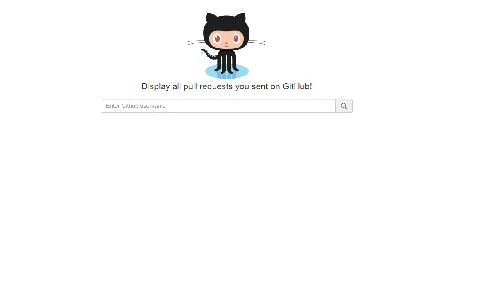

# Git pull requests

[](https://www.codacy.com/app/ducthienbui97/pullrequests?utm_source=github.com&utm_medium=referral&utm_content=ducthienbui97/pullrequests&utm_campaign=badger)
[](https://codeclimate.com/github/ducthienbui97/pullrequests)
[](https://gitlicense.com/license/ducthienbui97/pullrequests)
[](https://travis-ci.org/ducthienbui97/pullrequests)

Display pull requests, contributions for GitHub users.



## [Demo](https://pullrequests.surge.sh/)

## Setup

``` git
git clone git@github.com:ducthienbui97/pullrequests.git
cd pullrequests
yarn
```

If you prefer npm over yarn, replace ```yarn``` command with ```npm install```.

## Develop

All project's code is inside ```src``` folder.

You can run command ```yarn start``` or ```npm start``` to start developing process.
Open http://localhost:3000 to view it in the browser.
The page will reload if you make edits.
You will see the build errors and lint warnings in the console.

## Build

You can build app into build folder using ```yarn build``` or ```npm run build``` command. It correctly bundles React in production mode and optimizes the build for the best performance.

The app is ready to be deployed.

## Deploy

### Surge

```package.json``` is already configured to deploy to surge.sh. You can easily deploy using ```yarn deploy``` or ```npm run deploy```

### GitHub Pages

GitHub Pages does not work well with react-rounter. You can try the workaround written [here](https://github.com/rafrex/spa-github-pages).

## Contribution

All contributions is welcomed, feel free to [open a new issue](https://github.com/ducthienbui97/pullrequests/issues/new) to discuss about your idea or the bugs you found.